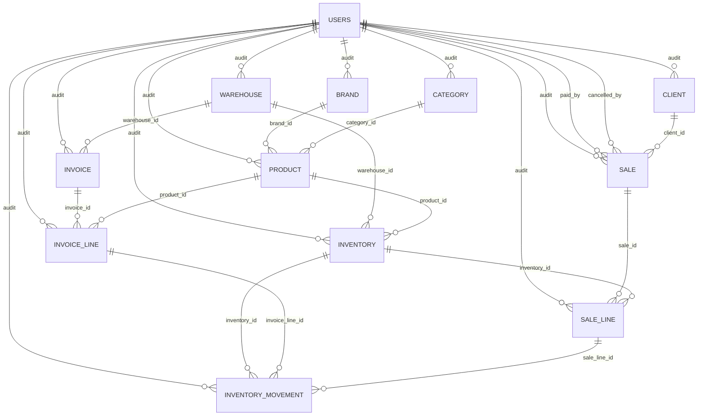

# Backend Current Logic

Documento vivo del estado actual del backend para inventario, facturas, ventas e historicos.

Objetivo:
- Tener un punto de referencia claro antes de cambiar reglas.
- Separar la logica vigente de cambios futuros.
- Reducir ambiguedad al retomar trabajo en backend.

Regla de mantenimiento:
- Cada cambio que modifique modelos, transiciones, side effects, calculos o historicos debe actualizar este documento en el mismo PR o commit.

Documento relacionado:
- `docs/backend-sales-reservations-proposal.md` fue la base funcional del bloque implementado el `2026-04-17`.

## Contrato de Error

- Todo error del backend responde con el mismo shape:
  - `message: string`
  - `errors: []`
- Los mensajes de usuario y validacion van en espanol.
- Los errores internos del servidor responden con mensajes genericos.
- Todo error manejado debe registrarse en logs con al menos: metodo HTTP, ruta, status, `message` y `errors`.
- `src/shared/exception_handlers.py` es la unica via permitida para respuestas JSON de error.
- No se deben agregar `JSONResponse(...)` manuales para errores en modulos nuevos.

## Politica de Autenticacion

- Todo endpoint de negocio bajo `/api/*` requiere usuario autenticado.
- La unica excepcion publica actual es `auth`:
  - `/api/auth/login`
  - `/api/auth/refresh`
- Esto aplica a catalogos, inventario, facturas, ventas, usuarios, clientes, almacenes y `bff`.
- La proteccion vive a nivel router con `Depends(get_current_user)`.
- Existe una prueba de arquitectura que falla si algun router de negocio pierde esa dependencia.

## Alcance

Este documento resume la logica implementada actualmente en:
- `src/shared/models`
- `src/modules/inventory`
- `src/modules/invoice`
- `src/modules/invoice_line`
- `src/modules/sale`
- `src/modules/product`
- `tests/test_inventory_*`
- `tests/test_invoice_flow.py`
- `tests/test_sales_paid.py`

## Mapa del dominio

### Catalogo
- `brand`: marca del producto.
- `category`: unico nivel de clasificacion.
- `product`: producto comercial.

### Operacion
- `warehouse`: almacen.
- `inventory`: existencia por combinacion `warehouse + product + box_size`.
- `inventory_movement`: historico de movimientos del inventario.

### Compras
- `invoice`: cabecera de compra.
- `invoice_line`: lineas de compra por `product + box_size`.

### Ventas
- `sale`: cabecera de venta.
- `sale_line`: lineas de venta ligadas a un `inventory` concreto.

## Base compartida

Todas las tablas heredan de `MyBaseModel`:
- `id`
- `is_active`
- `created_at`
- `updated_at`
- `deleted_at`
- `created_by`
- `updated_by`

Observacion:
- La auditoria base existe en todas las tablas, pero ventas ya agrega semantica propia adicional con `paid_by`, `cancelled_by`, `paid_at` y `cancelled_at`.

## Relaciones principales



## Reglas actuales por modulo

### 1. Catalogo

#### Brand
- `brand.name` es unico.

#### Category
- Ya no maneja jerarquia interna.
- Existe un solo nivel de clasificacion.

#### Product
- Tiene `category_id` y `brand_id`.
- `product.code` es unico.

Implicacion:
- El catalogo quedo simplificado a una sola categoria por producto.

### 2. Inventory

#### Definicion
- `inventory` representa stock por presentacion.
- La unicidad real del inventario es:
  - `warehouse_id`
  - `product_id`
  - `box_size`

#### Significado de stock
- `inventory.stock` representa existencias fisicas de esa presentacion.
- `box_size` define cuantas piezas contiene esa presentacion.
- `inventory.reserved_stock` representa apartados activos originados por ventas `DRAFT`.
- `available_stock` se interpreta como `stock - reserved_stock`.
- `reserved_stock` puede ser mayor que `stock`; eso significa sobreapartado y se trata como advertencia operativa, no como bloqueo automatico de captura.

#### Costos
- `avg_cost` y `last_cost` existen en `inventory`.
- Se almacenan como `Decimal` / `Numeric`.
- `avg_cost` sigue siendo referencial:
  - muestra aproximadamente a cuanto se ha comprado el producto
  - no fija el precio de venta
  - no funciona como costeo contable fuerte

#### Creacion manual
- Crear inventario registra movimiento manual de entrada si `stock > 0`.
- Si el inventario se crea con `box_size > 1`, el backend tambien crea o reactiva un placeholder unitario con `box_size = 1` y `stock = 0`.

#### Actualizacion manual
- Cambiar `stock` genera movimiento manual de ajuste.
- Cambiar `box_size` valida la unicidad de la nueva combinacion.
- No se permite editar costos manualmente desde el schema publico.

#### Baja logica
- El borrado es soft delete: `is_active = False`.
- Un inventario inactivo no puede participar en ventas nuevas, en reservas `DRAFT` ni en la aplicacion de una venta `DRAFT -> PAID`.

#### Detalle operativo
- El detalle de inventario expone:
  - `reserved_stock`
  - `available_stock`
  - `is_over_reserved`
  - `active_reservations`
- `active_reservations` lista las lineas de ventas `DRAFT` que estan afectando ese inventario.
- Para lineas por pieza sobre inventario de caja, `active_reservations` tambien expone proyeccion:
  - cuantas piezas se podrian surtir con stock unitario existente
  - cuantas cajas habria que abrir si la venta se pagara en ese momento
  - cuantas piezas sobrarian despues de esa apertura proyectada

### 3. Inventory Movement

#### Funcion
- Es la bitacora operativa de entradas y salidas de inventario.

#### Campos clave
- `source_type`: `INVOICE`, `SALE`, `MANUAL`
- `event_type`: evento concreto
- `movement_type`: `IN_` o `OUT`
- `value_type`: `COST` o `PRICE`
- `quantity`
- `unit_value`
- `prev_stock`
- `new_stock`
- `invoice_line_id`
- `sale_line_id`

#### Semantica actual
- `unit_value` representa el valor monetario unitario del movimiento.
- `value_type` define que significa ese valor:
  - `COST`: costo de compra / costo de ajuste
  - `PRICE`: precio de venta
- En compras y ajustes manuales, `value_type = COST`.
- En ventas, `value_type = PRICE`.

#### Eventos relevantes actuales
- Compras:
  - `INVOICE_RECEIVED`
  - `INVOICE_UNRECEIVED`
- Ventas:
  - `SALE_RESERVED`
  - `SALE_RELEASED`
  - `SALE_APPROVED`
  - `SALE_REVERSED`
- Apertura de caja:
  - `BOX_OPENED_OUT`
  - `BOX_OPENED_IN`
- Ajustes manuales:
  - `MANUAL_ADD`
  - `MANUAL_REMOVE`

#### Politica de historicos
- Nunca se desactivan movimientos por reversa.
- Toda reversa agrega un contramovimiento.
- El estado efectivo se determina por la ultima transicion relevante de cada linea.

### 4. Invoices

#### Estados
- `DRAFT`
- `ARRIVED`
- `CANCELLED`

#### Reglas de creacion
- Una factura se puede crear en `DRAFT` o `ARRIVED`.
- Si nace en `ARRIVED`, aplica inventario de inmediato.

#### Reglas de edicion
- Una factura en `ARRIVED` no se puede editar.
- Para editarla primero debe volver a `DRAFT`.
- Las mutaciones de estado y de lineas bloquean la fila de la factura durante la operacion.

#### Logica de lineas
- Cada linea maneja:
  - `product_id` o `new_product`
  - `box_size`
  - `quantity_boxes`
  - `total_units`
  - `price`
  - `price_type`
- Si el precio llega como `UNIT`, el backend lo normaliza a precio por caja/presentacion.
- El schema de creacion completa evita duplicados por `(product_id, box_size)` o por `new_product.code + box_size`.
- Los endpoints individuales de lineas usan la misma logica del servicio principal de facturas.
- Existe una restriccion unica para lineas activas por `(invoice_id, product_id, box_size)`.
- Si se hace soft delete de una linea, esa combinacion se puede volver a usar.

#### Producto inline desde factura
- Una linea de factura puede enviar `new_product`.
- Si llega `new_product`, el backend:
  - valida `code`, `brand_id` y `category_id`
  - crea el producto
  - crea la linea apuntando al nuevo `product_id`

#### Aplicacion al inventario al pasar a ARRIVED
- La transicion bloquea la factura y los inventarios involucrados.
- Por cada `invoice_line` activa y no aplicada:
  - busca `inventory` por `warehouse + product + box_size`
  - si no existe, lo crea
  - suma stock
  - recalcula `last_cost`
  - recalcula `avg_cost`
  - genera `inventory_movement` de entrada
  - marca `inventory_applied = True`

#### Reversa al volver de ARRIVED
- La transicion bloquea la factura y los inventarios involucrados.
- Por cada `invoice_line` aplicada:
  - resta stock
  - recalcula costo reciente
  - genera `INVOICE_UNRECEIVED`
  - marca `inventory_applied = False`

#### Cargos adicionales
- `general_expenses` se persiste como `logistic_tax`.
- `approximate_profit_rate` forma parte del modelo vigente.
- Decisiones actuales:
  - `general_expenses` es porcentaje
  - `approximate_profit_rate` es porcentaje
- Ambos se interpretan como porcentajes sobre `subtotal`:
  - `general_expenses_total = subtotal * general_expenses / 100`
  - `approximate_profit_total = subtotal * approximate_profit_rate / 100`
  - `total = subtotal + general_expenses_total + approximate_profit_total`

### 5. Sales

#### Estados
- `DRAFT`
- `PAID`
- `CANCELLED`

Compatibilidad:
- Si en base de datos existe `APPROVED`, el enum lo interpreta como `PAID`.

#### Reglas de creacion
- Una venta solo se crea en `DRAFT`.
- Al crearla en `DRAFT`, aparta inventario a nivel operativo.
- `DRAFT` representa compromiso comercial, no garantia de disponibilidad futura.
- El consumo fisico del inventario sucede al pasar a `PAID`.

#### Auditoria de venta
- `created_by` identifica quien creo la venta cuando hay usuario autenticado.
- `paid_by` y `paid_at` se llenan al pasar `DRAFT -> PAID`.
- `cancelled_by` y `cancelled_at` se llenan al pasar a `CANCELLED`.
- `updated_by` sigue significando "ultimo usuario que modifico la fila".

#### Logica de lineas
- Cada `sale_line` se liga a un `inventory_id`.
- La venta guarda snapshot comercial:
  - `box_size`
  - `price`
  - `price_type`
  - `unit_price`
  - `box_price`
  - `total_price`
  - `product_code`
  - `product_name`
- Cada linea tambien guarda:
  - `quantity_mode`: `BOX` o `UNIT`
  - `reservation_applied`
  - `inventory_applied`

#### Significado de cantidad en ventas
- A nivel API una linea puede enviarse como:
  - `quantity_boxes`
  - o `quantity_units`
- En creacion se exige exactamente una de las dos.
- En edicion se pueden omitir ambas si solo se cambia precio u otros datos.
- El modelo persistido sigue usando `quantity_units` como cantidad base, pero su significado real depende de `quantity_mode`.

#### Precio cero en DRAFT
- Una venta `DRAFT` puede contener lineas activas con `price = 0.00`.
- Una venta no puede pasar a `PAID` si alguna linea activa tiene precio `0.00`.

#### Apartado en DRAFT
- Al crear, editar o borrar lineas de una venta `DRAFT`:
  - se ajusta `inventory.reserved_stock` en el inventario efectivamente reservado
  - se marcan o limpian `sale_line.reservation_applied`
  - se generan movimientos `SALE_RESERVED` y `SALE_RELEASED`
- El apartado es blando:
  - varias ventas `DRAFT` pueden afectar el mismo inventario
  - el backend sigue permitiendo capturar ventas mientras exista stock fisico
  - `reserved_stock > stock` significa sobreapartado, no bloqueo automatico
- Si la linea es por pieza y parte de una presentacion de caja:
  - `DRAFT` no abre cajas
  - `DRAFT` reserva piezas logicamente en el inventario unitario `box_size = 1`
  - la linea sigue apuntando al inventario fuente para conservar la referencia comercial
  - la API expone proyeccion de cajas a abrir y piezas sobrantes si la venta se pagara en ese momento

#### Venta por pieza y apertura de caja
- Si una linea se captura como `quantity_units` sobre un inventario con `box_size > 1`, el backend no abre cajas en `DRAFT`.
- La apertura fisica ocurre solo al pasar la venta a `PAID`.
- En `PAID`:
  - primero usa piezas ya existentes en el inventario unitario
  - despues abre solo las cajas necesarias para completar lo faltante
  - registra `BOX_OPENED_OUT` y `BOX_OPENED_IN`
  - el sobrante de piezas abierto queda disponible en el inventario unitario

#### Aplicacion al inventario al pasar a PAID
- Bloquea la venta a nivel fila.
- Bloquea los inventarios involucrados.
- Por cada linea activa y no aplicada:
  - si la linea es por pieza y parte de una presentacion de caja:
    - usa primero piezas unitarias existentes
    - abre solo las cajas faltantes para completar la demanda
  - valida stock fisico suficiente
  - libera reserva si la linea estaba apartada
  - descuenta stock
  - crea `SALE_APPROVED`
  - marca `inventory_applied = True`
  - marca `reservation_applied = False`

#### Reversa al salir de PAID
- Si una venta `PAID` vuelve a `DRAFT` o `CANCELLED`:
  - repone stock
  - crea `SALE_REVERSED`
  - marca `inventory_applied = False`
- Si vuelve a `DRAFT`, despues reaplica el apartado.
- Si vuelve a `CANCELLED`, no reaplica apartado.

#### Edicion de ventas
- Si una venta esta en `DRAFT`, al agregar, editar o borrar lineas:
  - libera reservas necesarias
  - muta las lineas
  - recalcula total
  - vuelve a reservar segun el estado final
- Si una venta ya estaba `PAID`, al agregar, editar o borrar lineas:
  - primero revierte inventario
  - muta las lineas
  - recalcula total
  - vuelve a aplicar inventario

#### Responsable para PDF
- El PDF usa `paid_by` si existe.
- Si no existe `paid_by`, usa `updated_by` como fallback para "Atendido por".

### 6. Historicos y reportes

#### Historial de movimientos
- `inventory_service.list_movements` expone filtros por:
  - inventario
  - producto
  - almacen
  - factura
  - linea de factura
  - venta
  - linea de venta
  - rango de fechas
  - tipo de fuente
  - tipo de evento
  - tipo de movimiento

#### Metricas de producto
- El modulo de producto usa movimientos de salida para calcular:
  - ultimo precio de venta
  - precio promedio reciente de venta
- Esas metricas salen de `unit_value` filtrado con `value_type = PRICE`.
- El stock listado para producto ya expone:
  - `stock`
  - `reserved_stock`
  - `available_boxes`
  - `is_over_reserved`

### 7. Fechas y UTC

#### Regla actual
- Todos los `datetime` tecnicos del backend se manejan en UTC aware.
- Las respuestas publicas serializan esos `datetime` con offset explicito `+00:00`.
- Si un filtro o input recibe un `datetime` naive, el backend lo interpreta como UTC.

#### Alcance
- Esto aplica a:
  - `created_at`
  - `updated_at`
  - `deleted_at`
  - `movement_date`
  - `paid_at`
  - `cancelled_at`
- No cambia fechas de negocio tipo `date`, como:
  - `sale_date`
  - `invoice_date`
  - `order_date`
  - `arrival_date`

## Riesgos y ambiguedades actuales

### Riesgos importantes
- El apartado es blando: una venta `DRAFT` puede no llegar a `PAID` si otro flujo consume el stock fisico antes.
- La apertura automatica de caja depende de que el inventario origen enviado por la venta sea el correcto.

### Riesgos de reporte
- Cualquier reporte nuevo debe interpretar el valor monetario del movimiento usando `unit_value` + `value_type`.
- Cualquier reporte de inventario debe distinguir entre:
  - `stock` fisico
  - `reserved_stock`
  - `available_stock`

### Riesgos de consistencia
- Algunas reglas viven en schema o servicio, pero no en constraint de base de datos.
- Ejemplos:
  - sobreapartado permitido por diseno
  - reglas de producto inline en factura dependen de validacion de servicio y unicidad normal de `product.code`

## Decisiones aplicadas al dominio

- `subcategory` fue eliminada del dominio.
- `parent category` dejo de existir como concepto de negocio.
- `category` quedo como unico nivel de clasificacion.
- Ventas `DRAFT` apartan inventario con `reserved_stock`.
- `PAID` consume stock fisico y libera apartado.
- Las facturas pueden crear productos inline mediante `new_product`.
- La venta por pieza se resuelve en backend con apertura automatica de caja.

## Linea base para la proxima etapa

Antes de cambiar reglas, esta documentacion debe responder siempre:
- Que representa `stock`
- Que representa `reserved_stock`
- Que representa cada cantidad de venta y factura
- Cuando una transaccion afecta inventario
- Como se revierte una operacion
- Que significa cada dato monetario
- Que parte del historico es auditable y que parte es efectiva

## Propuesta de mantenimiento del documento

Cada cambio futuro debe actualizar al menos estas secciones si aplica:
- `Mapa del dominio`
- `Reglas actuales por modulo`
- `Riesgos y ambiguedades actuales`

Si el cambio modifica comportamiento, agregar ademas una nota breve al final con este formato:

```md
## Change Log

- YYYY-MM-DD: resumen corto del cambio funcional y modulos impactados.
```

## Change Log

- 2026-04-15: se documento el estado actual de inventario, facturas, ventas e historicos antes del refactor de reglas de negocio.
- 2026-04-15: `inventory.avg_cost` y `inventory.last_cost` se migraron a `Decimal` / `Numeric(12, 6)` en modelo, schemas y migracion de base de datos.
- 2026-04-15: se elimino `subcategory` del backend y `category` quedo como unico nivel de clasificacion.
- 2026-04-17: las ventas `DRAFT` pasaron a apartar inventario mediante `reserved_stock` y movimientos `SALE_RESERVED` / `SALE_RELEASED`.
- 2026-04-17: ventas ahora permiten precio `0.00` en `DRAFT`, agregan auditoria `paid_by` / `cancelled_by`, y soportan venta por pieza con apertura automatica de caja.
- 2026-04-17: facturas ahora pueden crear productos inline mediante `new_product`.
