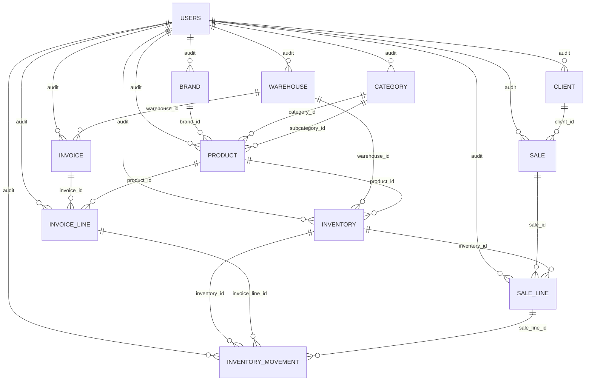

# Backend Current Logic

Documento vivo del estado actual del backend para inventario, facturas, ventas e históricos.

Objetivo:
- Tener un punto de referencia claro antes de cambiar reglas.
- Separar la lógica vigente de la lógica objetivo.
- Reducir ambigüedad al retomar trabajo en backend.

Regla de mantenimiento:
- Cada cambio que modifique modelos, transiciones, side effects, cálculos o históricos debe actualizar este documento en el mismo PR o commit.

## Alcance

Este documento resume la lógica implementada actualmente en:
- `src/shared/models`
- `src/modules/inventory`
- `src/modules/invoice`
- `src/modules/invoice_line`
- `src/modules/sale`
- `src/modules/product`
- `tests/test_inventory_*`
- `tests/test_invoice_flow.py`
- `tests/test_sales_paid.py`

## Mapa del dominio

### Catálogo
- `brand`: marca del producto.
- `category`: categoría y subcategoría lógica.
- `product`: producto comercial.

### Operación
- `warehouse`: almacén.
- `inventory`: existencia por combinación `warehouse + product + box_size`.
- `inventory_movement`: histórico de movimientos del inventario.

### Compras
- `invoice`: cabecera de compra.
- `invoice_line`: líneas de compra por `product + box_size`.

### Ventas
- `sale`: cabecera de venta.
- `sale_line`: líneas de venta ligadas a un `inventory` concreto.

## Base compartida

Todas las tablas heredan de `MyBaseModel`:
- `id`
- `is_active`
- `created_at`
- `updated_at`
- `deleted_at`
- `created_by`
- `updated_by`

Observación:
- La auditoría existe a nivel modelo, pero no está usada de forma consistente en todos los módulos.

## Relaciones principales



## Reglas actuales por módulo

### 1. Catálogo

#### Brand
- `brand.name` es único.

#### Category
- `category.parent_id` existe como campo, pero hoy no está amarrado con FK.
- El sistema usa `category_id` y `subcategory_id` en `product`.
- No existe una validación fuerte que obligue a que la subcategoría pertenezca a la categoría seleccionada.

#### Product
- Tiene `category_id`, `subcategory_id`, `brand_id`.
- `product.code` es único.
- `subcategory_id` es opcional.

Implicación:
- El catálogo permite representar categoría y subcategoría, pero la integridad jerárquica depende de lógica de aplicación y hoy está incompleta.

### 2. Inventory

#### Definición
- `inventory` representa stock por presentación.
- La unicidad real del inventario es:
  - `warehouse_id`
  - `product_id`
  - `box_size`

#### Significado de stock
- `inventory.stock` representa cajas o presentaciones disponibles, no piezas sueltas.
- `box_size` define cuántas piezas contiene esa presentación.

#### Costos
- `avg_cost` y `last_cost` existen en `inventory`.
- Hoy siguen almacenados como `float`.

#### Creación manual
- Crear inventario registra movimiento manual de entrada si `stock > 0`.
- Si el inventario se crea con `box_size > 1`, el backend también crea o reactiva un placeholder unitario con `box_size = 1` y `stock = 0`.

#### Actualización manual
- Cambiar `stock` genera movimiento manual de ajuste.
- Cambiar `box_size` valida la unicidad de la nueva combinación.
- No se permite editar costos manualmente desde el schema público.

#### Baja lógica
- El borrado es soft delete: `is_active = False`.
- Actualmente un inventario inactivo todavía puede ser referenciado por ventas si se usa su `id`.

### 3. Inventory Movement

#### Función
- Es la bitácora operativa de entradas y salidas de inventario.

#### Campos clave
- `source_type`: `INVOICE`, `SALE`, `MANUAL`
- `event_type`: evento concreto
- `movement_type`: `IN` o `OUT`
- `quantity`
- `unit_cost`
- `prev_stock`
- `new_stock`
- `invoice_line_id`
- `sale_line_id`

#### Semántica actual
- En compras, `unit_cost` sí representa costo de entrada.
- En ventas, `unit_cost` guarda el precio usado en la venta, no el costo del inventario.

Implicación:
- El campo `unit_cost` está semánticamente sobrecargado.
- Algunos reportes lo usan como precio promedio/último precio de venta.

### 4. Invoices

#### Estados
- `DRAFT`
- `ARRIVED`
- `CANCELLED`

#### Reglas de creación
- Una factura se puede crear en `DRAFT` o `ARRIVED`.
- Si nace en `ARRIVED`, aplica inventario de inmediato.

#### Reglas de edición
- Una factura en `ARRIVED` no se puede editar.
- Para editarla primero debe volver a `DRAFT`.

#### Lógica de líneas
- Cada línea maneja:
  - `product_id`
  - `box_size`
  - `quantity_boxes`
  - `total_units`
  - `price`
  - `price_type`
- Si el precio llega como `UNIT`, el backend lo normaliza a precio por caja/presentación.
- El schema de creación completa evita duplicados por `(product_id, box_size)`.
- Los endpoints individuales de líneas no amarran esa misma regla con constraint de base de datos.

#### Aplicación al inventario al pasar a ARRIVED
- Por cada `invoice_line` activa y no aplicada:
  - busca `inventory` por `warehouse + product + box_size`
  - si no existe, lo crea
  - suma stock
  - recalcula `last_cost`
  - recalcula `avg_cost`
  - genera `inventory_movement` de entrada
  - marca `inventory_applied = True`

#### Reversa al volver de ARRIVED
- Por cada `invoice_line` aplicada:
  - resta stock
  - desactiva movimientos previos de entrada de esa línea
  - recalcula costo reciente
  - genera nuevo movimiento `INVOICE_UNRECEIVED`
  - marca `inventory_applied = False`

#### Costo promedio actual
- El promedio se recalcula usando movimientos recientes de entrada.
- La ventana actual es de 6 meses.
- No está basado en stock vigente real.

Implicación:
- El costo promedio actual es útil como heurística operativa, pero no como costeo contable robusto.

#### Cargos adicionales
- `general_expenses` se persiste como `logistic_tax`.
- Actualmente hay trabajo local en curso para manejar también `approximate_profit_rate`.

### 5. Sales

#### Estados
- `DRAFT`
- `PAID`
- `CANCELLED`

Compatibilidad:
- Si en base de datos existe `APPROVED`, el enum lo interpreta como `PAID`.

#### Reglas de creación
- Una venta solo se crea en `DRAFT`.
- No descuenta inventario al crearla.
- El descuento sucede al pasar a `PAID`.

#### Lógica de líneas
- Cada `sale_line` se liga a un `inventory_id`.
- La venta guarda snapshot comercial:
  - `box_size`
  - `price`
  - `price_type`
  - `unit_price`
  - `box_price`
  - `total_price`
  - `product_code`
  - `product_name`

#### Significado de cantidad en ventas
- A nivel API se usa `quantity_boxes`.
- En el modelo persistido existe `quantity_units`, pero hoy se usa como alias de cajas.

Implicación:
- El nombre `quantity_units` es engañoso en el estado actual del dominio.

#### Aplicación al inventario al pasar a PAID
- Bloquea la venta a nivel fila.
- Bloquea los inventarios involucrados.
- Por cada línea activa y no aplicada:
  - valida stock suficiente
  - descuenta stock
  - crea movimiento `SALE_APPROVED`
  - marca `inventory_applied = True`

#### Reversa al salir de PAID
- Si una venta `PAID` vuelve a `DRAFT` o `CANCELLED`:
  - repone stock
  - crea movimiento `SALE_REVERSED`
  - marca `inventory_applied = False`

#### Edición de ventas pagadas
- Si una venta ya estaba `PAID`, al agregar, editar o borrar líneas:
  - primero revierte inventario
  - muta las líneas
  - recalcula total
  - vuelve a aplicar inventario

#### Responsable de entrega
- Cuando una venta pasa a `PAID`, se guarda `updated_by` con el usuario autenticado.
- El PDF usa ese dato como "Atendido por".

### 6. Históricos y reportes

#### Historial de movimientos
- `inventory_service.list_movements` expone filtros por:
  - inventario
  - producto
  - almacén
  - factura
  - línea de factura
  - venta
  - línea de venta
  - rango de fechas
  - tipo de fuente
  - tipo de evento
  - tipo de movimiento

#### Diferencia actual entre reversas
- Reversa de factura:
  - desactiva movimientos previos de entrada
  - agrega nuevo movimiento de salida
- Reversa de venta:
  - no desactiva la salida previa
  - agrega nuevo movimiento de entrada

Implicación:
- Hoy no existe una política uniforme de histórico.

#### Métricas de producto
- El módulo de producto usa movimientos de salida para calcular:
  - último precio de venta
  - precio promedio reciente de venta
- Esas métricas salen del campo `unit_cost` del movimiento.

## Riesgos y ambigüedades actuales

### Riesgos importantes
- Facturas no tienen el mismo nivel de protección transaccional y locking que ventas.
- El promedio de costo no representa necesariamente el costo real del stock vigente.
- Un inventario inactivo todavía puede terminar en una venta si se referencia por `id`.
- `quantity_units` en ventas no significa realmente unidades físicas en la lógica actual.
- La jerarquía categoría/subcategoría no está cerrada a nivel de integridad.
- El histórico de movimientos mezcla dos criterios distintos de reversa.

### Riesgos de reporte
- `unit_cost` en ventas realmente representa precio de venta.
- El nombre del campo puede inducir reportes equivocados si se interpreta como costo.

### Riesgos de consistencia
- Algunas reglas viven en schema o servicio, pero no en constraint de base de datos.
- Ejemplo:
  - duplicados de líneas de factura por producto y presentación
  - relación válida entre categoría y subcategoría

## Estado del trabajo local antes de refactor

Cambios backend actualmente presentes en el workspace:
- Placeholder unitario automático en inventario al crear presentaciones con `box_size > 1`.
- Soporte en curso para `approximate_profit_rate` en facturas.
- Migración local nueva:
  - `alembic/versions/0009_add_invoice_approximate_profit_rate.py`

## Línea base para la próxima etapa

Antes de cambiar reglas, esta documentación debe responder siempre:
- Qué representa `stock`
- Qué representa cada cantidad de venta y factura
- Cuándo una transacción afecta inventario
- Cómo se revierte una operación
- Qué significa cada dato monetario
- Qué parte del histórico es auditable y qué parte es "efectiva"

## Propuesta de mantenimiento del documento

Cada cambio futuro debe actualizar al menos estas secciones si aplica:
- `Mapa del dominio`
- `Reglas actuales por módulo`
- `Riesgos y ambigüedades actuales`
- `Estado del trabajo local antes de refactor`

Si el cambio modifica comportamiento, agregar además una nota breve al final con este formato:

```md
## Change Log

- YYYY-MM-DD: resumen corto del cambio funcional y módulos impactados.
```

## Change Log

- 2026-04-15: se documentó el estado actual de inventario, facturas, ventas e históricos antes del refactor de reglas de negocio.
