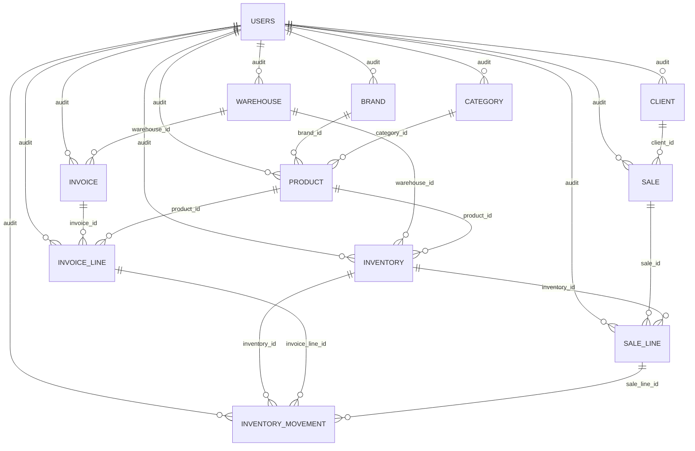

# Backend Current Logic

Documento vivo del estado actual del backend para inventario, facturas, ventas e históricos.

Objetivo:
- Tener un punto de referencia claro antes de cambiar reglas.
- Separar la lógica vigente de la lógica objetivo.
- Reducir ambigüedad al retomar trabajo en backend.

Regla de mantenimiento:
- Cada cambio que modifique modelos, transiciones, side effects, cálculos o históricos debe actualizar este documento en el mismo PR o commit.

## Contrato de Error

- Todo error del backend debe responder con el mismo shape:
  - `message: string`
  - `errors: []`
- Los mensajes orientados a usuario y validación deben ir en español.
- Los errores internos del servidor deben responder con mensajes genéricos, sin exponer detalles técnicos.
- Todo error manejado por el backend debe registrarse en logs con al menos: método HTTP, ruta, status, `message` y `errors`.
- `src/shared/exception_handlers.py` es la única vía permitida para respuestas JSON de error.
- No se deben agregar `JSONResponse(...)` manuales para errores en módulos nuevos.
- Para errores simples:
  - `message` describe el problema
  - `errors` va vacío
- Para errores de validación o conflicto por campo:
  - `message` describe el contexto general
  - `errors` contiene objetos con:
    - `field`
    - `message`
    - `code` opcional
- Esto aplica a:
  - `HTTPException`
  - validaciones `422`
  - rutas inexistentes
  - errores internos `500`

## Alcance

Este documento resume la lógica implementada actualmente en:
- `src/shared/models`
- `src/modules/inventory`
- `src/modules/invoice`
- `src/modules/invoice_line`
- `src/modules/sale`
- `src/modules/product`
- `tests/test_inventory_*`
- `tests/test_invoice_flow.py`
- `tests/test_sales_paid.py`

## Mapa del dominio

### Catálogo
- `brand`: marca del producto.
- `category`: categoría y subcategoría lógica.
- `product`: producto comercial.

### Operación
- `warehouse`: almacén.
- `inventory`: existencia por combinación `warehouse + product + box_size`.
- `inventory_movement`: histórico de movimientos del inventario.

### Compras
- `invoice`: cabecera de compra.
- `invoice_line`: líneas de compra por `product + box_size`.

### Ventas
- `sale`: cabecera de venta.
- `sale_line`: líneas de venta ligadas a un `inventory` concreto.

## Base compartida

Todas las tablas heredan de `MyBaseModel`:
- `id`
- `is_active`
- `created_at`
- `updated_at`
- `deleted_at`
- `created_by`
- `updated_by`

Observación:
- La auditoría existe a nivel modelo, pero no está usada de forma consistente en todos los módulos.

## Relaciones principales



## Reglas actuales por módulo

### 1. Catálogo

#### Brand
- `brand.name` es único.

#### Category
- `category` ya no maneja jerarquía interna.
- Existe un solo nivel de clasificación.
- No existe una validación fuerte que obligue a que la subcategoría pertenezca a la categoría seleccionada.

#### Product
- Tiene `category_id` y `brand_id`.
- `product.code` es único.

Implicación:
- El catálogo quedó simplificado a una sola categoría por producto.

### 2. Inventory

#### Definición
- `inventory` representa stock por presentación.
- La unicidad real del inventario es:
  - `warehouse_id`
  - `product_id`
  - `box_size`

#### Significado de stock
- `inventory.stock` representa cajas o presentaciones disponibles, no piezas sueltas.
- `box_size` define cuántas piezas contiene esa presentación.

#### Costos
- `avg_cost` y `last_cost` existen en `inventory`.
- Se almacenan como `Decimal` / `Numeric` para evitar pérdida de precisión.

#### Creación manual
- Crear inventario registra movimiento manual de entrada si `stock > 0`.
- Si el inventario se crea con `box_size > 1`, el backend también crea o reactiva un placeholder unitario con `box_size = 1` y `stock = 0`.

#### Actualización manual
- Cambiar `stock` genera movimiento manual de ajuste.
- Cambiar `box_size` valida la unicidad de la nueva combinación.
- No se permite editar costos manualmente desde el schema público.

#### Baja lógica
- El borrado es soft delete: `is_active = False`.
- Un inventario inactivo no debe participar en ventas nuevas ni en la aplicación de una venta `DRAFT -> PAID`.
- Si una venta vieja ya lo referenciaba y luego se desactiva, cualquier nuevo intento de usarlo en ventas debe fallar.

### 3. Inventory Movement

#### Función
- Es la bitácora operativa de entradas y salidas de inventario.

#### Campos clave
- `source_type`: `INVOICE`, `SALE`, `MANUAL`
- `event_type`: evento concreto
- `movement_type`: `IN` o `OUT`
- `value_type`: `COST` o `PRICE`
- `quantity`
- `unit_value`
- `prev_stock`
- `new_stock`
- `invoice_line_id`
- `sale_line_id`

#### Semántica actual
- `unit_value` representa el valor monetario unitario del movimiento.
- `value_type` es quien define qué significa ese valor:
  - `COST`: costo de compra / costo de ajuste
  - `PRICE`: precio de venta
- En compras y ajustes manuales, `value_type = COST`.
- En ventas, `value_type = PRICE`.

Implicación:
- El valor monetario del movimiento debe interpretarse siempre junto con `value_type`.
- Los reportes de ventas y compras ya no dependen de un nombre que sugiera costo cuando el valor real puede ser precio.

### 4. Invoices

#### Estados
- `DRAFT`
- `ARRIVED`
- `CANCELLED`

#### Reglas de creación
- Una factura se puede crear en `DRAFT` o `ARRIVED`.
- Si nace en `ARRIVED`, aplica inventario de inmediato.

#### Reglas de edición
- Una factura en `ARRIVED` no se puede editar.
- Para editarla primero debe volver a `DRAFT`.

#### Lógica de líneas
- Cada línea maneja:
  - `product_id`
  - `box_size`
  - `quantity_boxes`
  - `total_units`
  - `price`
  - `price_type`
- Si el precio llega como `UNIT`, el backend lo normaliza a precio por caja/presentación.
- El schema de creación completa evita duplicados por `(product_id, box_size)`.
- Los endpoints individuales de líneas no amarran esa misma regla con constraint de base de datos.

#### Aplicación al inventario al pasar a ARRIVED
- Por cada `invoice_line` activa y no aplicada:
  - busca `inventory` por `warehouse + product + box_size`
  - si no existe, lo crea
  - suma stock
  - recalcula `last_cost`
  - recalcula `avg_cost`
  - genera `inventory_movement` de entrada
  - marca `inventory_applied = True`

#### Reversa al volver de ARRIVED
- Por cada `invoice_line` aplicada:
  - resta stock
  - recalcula costo reciente
  - genera nuevo movimiento `INVOICE_UNRECEIVED`
  - marca `inventory_applied = False`

#### Costo promedio actual
- El promedio se recalcula usando movimientos recientes de entrada.
- La ventana actual es de 6 meses.
- No está basado en stock vigente real.
- Su intención en negocio es referencial:
  - mostrar aproximadamente a cuánto se ha comprado el producto
  - no fijar el precio de venta
  - no funcionar como costeo contable fuerte
- El precio de venta sigue dependiendo de la venta concreta y del cliente.

Implicación:
- El costo promedio actual es útil como referencia operativa de compra, pero no como costeo contable robusto.

#### Cargos adicionales
- `general_expenses` se persiste como `logistic_tax`.
- `approximate_profit_rate` también forma parte del modelo vigente.
- Decisión actual del dominio:
  - `general_expenses` es porcentaje.
  - `approximate_profit_rate` es porcentaje.
  - El frontend puede calcularlos para visualización, pero backend los mantiene y responde como tasas porcentuales.
- En el estado actual ambos campos se interpretan como porcentajes sobre `subtotal` en la respuesta:
  - `general_expenses_total = subtotal * general_expenses / 100`
  - `approximate_profit_total = subtotal * approximate_profit_rate / 100`
  - `total = subtotal + general_expenses_total + approximate_profit_total`

### 5. Sales

#### Estados
- `DRAFT`
- `PAID`
- `CANCELLED`

Compatibilidad:
- Si en base de datos existe `APPROVED`, el enum lo interpreta como `PAID`.

#### Reglas de creación
- Una venta solo se crea en `DRAFT`.
- No descuenta inventario al crearla.
- El descuento sucede al pasar a `PAID`.

#### Lógica de líneas
- Cada `sale_line` se liga a un `inventory_id`.
- La venta guarda snapshot comercial:
  - `box_size`
  - `price`
  - `price_type`
  - `unit_price`
  - `box_price`
  - `total_price`
  - `product_code`
  - `product_name`

#### Significado de cantidad en ventas
- A nivel API se usa `quantity_boxes`.
- En el modelo persistido existe `quantity_units`, pero hoy se usa como alias de cajas.

Implicación:
- El nombre `quantity_units` es engañoso en el estado actual del dominio.

#### Aplicación al inventario al pasar a PAID
- Bloquea la venta a nivel fila.
- Bloquea los inventarios involucrados.
- Por cada línea activa y no aplicada:
  - valida stock suficiente
  - descuenta stock
  - crea movimiento `SALE_APPROVED`
  - marca `inventory_applied = True`

#### Reversa al salir de PAID
- Si una venta `PAID` vuelve a `DRAFT` o `CANCELLED`:
  - repone stock
  - crea movimiento `SALE_REVERSED`
  - marca `inventory_applied = False`

#### Edición de ventas pagadas
- Si una venta ya estaba `PAID`, al agregar, editar o borrar líneas:
  - primero revierte inventario
  - muta las líneas
  - recalcula total
  - vuelve a aplicar inventario

#### Responsable de entrega
- Cuando una venta pasa a `PAID`, se guarda `updated_by` con el usuario autenticado.
- El PDF usa ese dato como "Atendido por".

### 6. Históricos y reportes

#### Historial de movimientos
- `inventory_service.list_movements` expone filtros por:
  - inventario
  - producto
  - almacén
  - factura
  - línea de factura
  - venta
  - línea de venta
  - rango de fechas
  - tipo de fuente
  - tipo de evento
  - tipo de movimiento

#### Diferencia actual entre reversas
- Reversa de factura:
  - agrega nuevo movimiento de salida
- Reversa de venta:
  - agrega nuevo movimiento de entrada

Implicación:
- Todo histórico de inventario sigue una sola política:
  - nunca se desactivan movimientos por reversa
  - toda reversa agrega un contramovimiento
  - el estado efectivo se determina por la última transición de cada línea

#### Métricas de producto
- El módulo de producto usa movimientos de salida para calcular:
  - último precio de venta
  - precio promedio reciente de venta
- Esas métricas salen del campo `unit_value` del movimiento filtrado con `value_type = PRICE`.

### 7. Fechas y UTC

#### Regla actual
- Todos los `datetime` técnicos del backend se manejan en UTC aware.
- Las respuestas públicas serializan esos `datetime` con offset explícito `+00:00`.
- Si un filtro o input recibe un `datetime` naive, el backend lo interpreta como UTC.

#### Alcance
- Esto aplica a:
  - `created_at`
  - `updated_at`
  - `deleted_at`
  - `movement_date`
- No cambia fechas de negocio tipo `date`, como:
  - `sale_date`
  - `invoice_date`
  - `order_date`
  - `arrival_date`

## Riesgos y ambigüedades actuales

### Riesgos importantes
- Facturas no tienen el mismo nivel de protección transaccional y locking que ventas.
- `quantity_units` en ventas no significa realmente unidades físicas en la lógica actual.

### Riesgos de reporte
- Cualquier reporte nuevo debe interpretar el valor monetario del movimiento usando `unit_value` + `value_type`.

### Riesgos de consistencia
- Algunas reglas viven en schema o servicio, pero no en constraint de base de datos.
- Ejemplo:
  - duplicados de líneas de factura por producto y presentación
  - relación válida entre categoría y subcategoría

## Estado del trabajo local antes de refactor

Cambios backend actualmente presentes en el workspace:
- Placeholder unitario automático en inventario al crear presentaciones con `box_size > 1`.
- Soporte en curso para `approximate_profit_rate` en facturas.
- Migración local nueva:
  - `alembic/versions/0009_add_invoice_approximate_profit_rate.py`
  - `alembic/versions/r010_inventory_costs_to_decimal.py`
  - `alembic/versions/r011_remove_subcategory_and_category_parent.py`

## Decisiones aplicadas al dominio

Decisiones ya implementadas en backend:

- `subcategory` fue eliminada del dominio.
- `parent category` dejó de existir como concepto de negocio.
- `category` quedó como único nivel de clasificación.

## Línea base para la próxima etapa

Antes de cambiar reglas, esta documentación debe responder siempre:
- Qué representa `stock`
- Qué representa cada cantidad de venta y factura
- Cuándo una transacción afecta inventario
- Cómo se revierte una operación
- Qué significa cada dato monetario
- Qué parte del histórico es auditable y qué parte es "efectiva"

## Propuesta de mantenimiento del documento

Cada cambio futuro debe actualizar al menos estas secciones si aplica:
- `Mapa del dominio`
- `Reglas actuales por módulo`
- `Riesgos y ambigüedades actuales`
- `Estado del trabajo local antes de refactor`

Si el cambio modifica comportamiento, agregar además una nota breve al final con este formato:

```md
## Change Log

- YYYY-MM-DD: resumen corto del cambio funcional y módulos impactados.
```

## Change Log

- 2026-04-15: se documentó el estado actual de inventario, facturas, ventas e históricos antes del refactor de reglas de negocio.
- 2026-04-15: `inventory.avg_cost` y `inventory.last_cost` se migraron a `Decimal` / `Numeric(12, 6)` en modelo, schemas y migración de base de datos.
- 2026-04-15: se eliminó `subcategory` del backend y `category` quedó como único nivel de clasificación.
