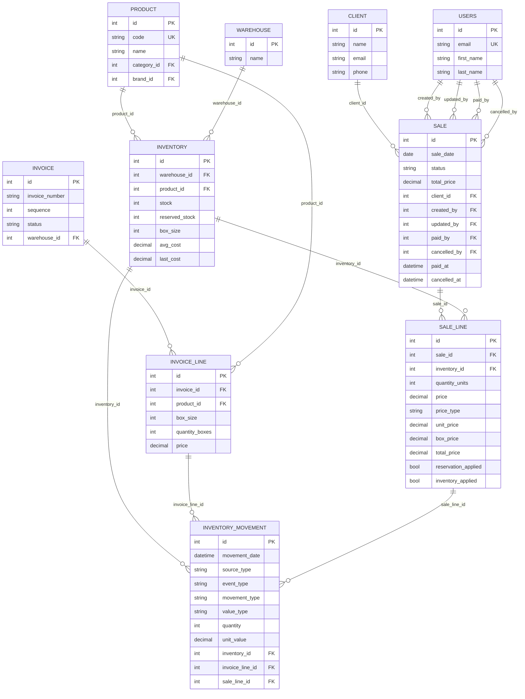

# Backend Sales Reservations Proposal

Documento de propuesta para la siguiente evolución del backend en ventas, inventario y facturas.

Estado:
- Documento de diseño usado como base funcional y técnica.
- La mayor parte de este bloque ya fue implementada en backend el `2026-04-17`.
- La referencia operativa vigente está en `docs/backend-current-logic.md`.

Relación con otros documentos:
- `docs/backend-current-logic.md` describe la lógica vigente.
- Este documento conserva la lógica objetivo y las decisiones que dieron origen al cambio.

## Objetivo

Resolver estos frentes de negocio:
- Permitir ventas `DRAFT` con precio `0.00`.
- Registrar quién creó la venta, quién la mandó a `PAID` y quién la canceló.
- Habilitar creación de producto desde factura.
- Soportar venta por pieza con apertura automática de caja.
- Introducir modo de inventario apartado sobre ventas `DRAFT`.

## Decisiones de dominio

### 1. Venta `DRAFT` con precio cero

Reglas:
- Una venta en `DRAFT` sí puede contener líneas con `price = 0.00`.
- Una venta en `PAID` no puede tener líneas activas con `price = 0.00`.
- Al intentar pasar `DRAFT -> PAID`, el backend debe validar:
  - todas las líneas activas tienen precio mayor a `0.00`
  - existe stock físico suficiente en ese momento

Objetivo:
- permitir captura temprana de ventas todavía no cotizadas
- evitar cerrar una venta sin precio definido

### 2. Auditoría de venta

Reglas:
- `sale.created_by`: usuario que creó la venta
- `sale.paid_by`: usuario que la mandó a `PAID`
- `sale.cancelled_by`: usuario que la mandó a `CANCELLED`
- `sale.paid_at`: timestamp de transición a `PAID`
- `sale.cancelled_at`: timestamp de transición a `CANCELLED`

Reglas adicionales:
- `updated_by` deja de ser el campo principal para semántica de negocio en ventas.
- `updated_by` puede seguir significando "último usuario que modificó la fila".
- `paid_by` y `cancelled_by` no deben sobreescribirse con cambios posteriores de edición.

### 3. Modo de apartado en ventas `DRAFT`

Definición:
- una venta `DRAFT` aparta inventario a nivel operativo
- ese apartado no es exclusivo ni garantizado
- varias ventas `DRAFT` pueden apartar el mismo inventario
- otra venta todavía se puede crear aunque el producto ya esté apartado

Esto modela:
- compromiso comercial
- visibilidad operativa
- advertencia al usuario

Esto no modela:
- reserva dura
- garantía de disponibilidad futura

#### Semántica propuesta

- `inventory.stock`:
  - stock físico real
- `inventory.reserved_stock`:
  - suma de apartados activos por ventas `DRAFT`
- `available_stock`:
  - cálculo derivado `stock - reserved_stock`

Observación:
- `reserved_stock` sí puede ser mayor que `stock`
- eso significa sobreapartado
- el backend no debe bloquear la captura por ese motivo
- el frontend debe mostrar advertencia

#### Reglas del apartado

- Al crear una venta `DRAFT`:
  - valida que exista inventario activo
  - valida que exista stock físico mayor a `0`
  - incrementa `reserved_stock`
  - marca `sale_line.reservation_applied = true`
  - crea movimiento de inventario `SALE_RESERVED`

- Al editar una venta `DRAFT`:
  - recalcula la reserva de sus líneas
  - ajusta `reserved_stock`
  - crea movimientos según corresponda:
    - `SALE_RESERVED`
    - `SALE_RELEASED`

- Al eliminar una línea de una venta `DRAFT`:
  - libera la reserva
  - decrementa `reserved_stock`
  - crea movimiento `SALE_RELEASED`

- Al pasar `DRAFT -> PAID`:
  - valida stock físico real
  - descuenta `stock`
  - libera `reserved_stock`
  - mantiene trazabilidad con movimientos
  - marca:
    - `reservation_applied = false`
    - `inventory_applied = true`

- Al pasar `DRAFT -> CANCELLED`:
  - libera `reserved_stock`
  - no descuenta `stock`
  - marca `reservation_applied = false`

- Al pasar `PAID -> DRAFT`:
  - repone `stock`
  - vuelve a aplicar apartado como `DRAFT`
  - valida que el inventario siga activo

#### Consecuencia importante

Una venta `DRAFT` no garantiza que después podrá cerrarse.

Por eso:
- `DRAFT` representa apartado comercial
- `PAID` representa consumo confirmado

### 4. Venta por pieza con apertura automática de caja

Decisión:
- esto debe resolverse en backend

Motivo:
- involucra integridad de inventario
- requiere locks y trazabilidad
- no debe depender de cálculos del frontend

#### Regla propuesta

Si una venta quiere salir por pieza:
- el backend debe identificar el inventario de caja fuente
- en `DRAFT` solo debe proyectar cuantas cajas harian falta y cuantas piezas sobrarian
- en `PAID` debe mover contenido desde la caja al inventario unitario `box_size = 1`
- luego debe vender desde el inventario unitario

Supuestos:
- ya existe placeholder unitario `box_size = 1`
- abrir caja significa convertir:
  - `1` caja en inventario origen
  - `box_size` piezas en inventario unitario

Movimientos sugeridos:
- `BOX_OPENED_OUT`
- `BOX_OPENED_IN`

Pregunta operativa pendiente:
- si existen varias cajas candidatas para abrir, el backend debe usar una regla fija

Regla recomendada:
- usar inventario exacto enviado por el frontend como caja origen
- no inferir automáticamente entre varias presentaciones distintas

### 5. Crear producto desde factura

Decisión:
- sí se debe poder
- pero como flujo propio de factura, no reutilizando el alta manual de inventario

Regla propuesta:
- una línea de factura debe permitir:
  - `product_id`
  - o `new_product`

`new_product` incluiría al menos:
- `name`
- `code`
- `description`
- `category_id`
- `brand_id`
- opcional `image`

Flujo:
- backend crea el producto
- backend crea la línea de factura apuntando al nuevo producto
- si la factura nace o pasa a `ARRIVED`, el inventario se aplica normalmente

## Cambios propuestos a modelo

### Inventory

Nuevos campos:
- `reserved_stock: int default 0`

Campos derivados en responses:
- `available_stock = stock - reserved_stock`
- `is_over_reserved = reserved_stock > stock`

### Sale

Nuevos campos:
- `paid_by: int | null`
- `cancelled_by: int | null`
- `paid_at: datetime | null`
- `cancelled_at: datetime | null`

Uso de campos base:
- `created_by`: creador de la venta
- `updated_by`: último editor técnico

### SaleLine

Nuevos campos:
- `reservation_applied: bool default false`
- opcional futuro:
  - `quantity_mode: BOX | UNIT`

### InventoryMovement

Nuevos `event_type`:
- `SALE_RESERVED`
- `SALE_RELEASED`
- `BOX_OPENED_OUT`
- `BOX_OPENED_IN`

Se mantienen:
- `SALE_APPROVED`
- `SALE_REVERSED`

## Cambios propuestos a API

### Sales

`POST /api/sales/create`
- debe aceptar líneas con `price = 0.00`
- si crea en `DRAFT`, aplica apartado

`PUT /api/sales/update-status/{sale_id}`
- `DRAFT -> PAID`:
  - valida precio
  - valida stock físico
  - registra `paid_by` y `paid_at`
- `DRAFT -> CANCELLED`:
  - libera apartado
  - registra `cancelled_by` y `cancelled_at`

### Inventory detail

Agregar en detalle de inventario:
- `reserved_stock`
- `available_stock`
- `is_over_reserved`
- `active_reservations`

`active_reservations` debe incluir:
- `sale_id`
- `sale_date`
- `status`
- `client`
- `sale_line_id`
- `quantity_boxes`
- `price`
- `notes`
- `created_by`
- `updated_at`

## Consultas nuevas recomendadas

### Inventario afectado por apartados

Capacidad deseada:
- entrar al inventario
- ver qué ventas lo están afectando
- saber si está sobreapartado

Consulta base:
- `sale_line` activas
- `reservation_applied = true`
- `sale.status = DRAFT`
- agrupadas o listadas por `inventory_id`

### Reporte operativo

Sería útil exponer:
- inventarios con `reserved_stock > 0`
- inventarios con `reserved_stock > stock`
- ventas `DRAFT` con conflicto de disponibilidad

## DER propuesto

## Orden recomendado de implementación

### Fase 1
- auditoría de venta:
  - `created_by`
  - `paid_by`
  - `cancelled_by`
  - `paid_at`
  - `cancelled_at`
- permitir `price = 0.00` en `DRAFT`
- bloquear `PAID` con líneas de precio cero

### Fase 2
- `reserved_stock`
- `reservation_applied`
- movimientos `SALE_RESERVED` y `SALE_RELEASED`
- detalle de inventario con ventas que lo apartan

### Fase 3
- apertura de caja para venta por pieza

### Fase 4
- creación de producto desde factura

## Riesgos

- sobreapartado:
  - puede haber más apartado que stock físico
- frustración operativa:
  - una venta `DRAFT` puede no llegar a `PAID`
- complejidad de movimientos:
  - ya no basta distinguir entre venta aprobada y revertida
- apertura de caja:
  - requiere una regla de origen bien definida

## Regla de comunicación para frontend

El frontend debe tratar `DRAFT` como:
- apartado operativo
- no disponibilidad garantizada

El backend debe ser la fuente de verdad para:
- stock físico
- stock apartado
- conflicto de sobreapartado
- validación final al pasar a `PAID`
